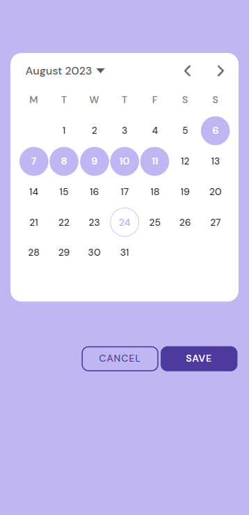

<!-- PROJECT LOGO -->

<p align="center">
  <a href="https://github.com/othneildrew/Best-README-Template">
    
  </a>
  <h3 align="center">Peri</h3>

  <p align="center">
    The Period Tracker App
  </p>
  <p align="center">
    <a href="https://irasoro.github.io/peri/">View Demo</a>
  </p>
</p>

<!-- ABOUT THE PROJECT -->
### About The Project

Peri is period tracker application. The application has the necessary features that help you track your cycle. App show:

- number of days before menstruation,
- current cycle day,
- chance of getting pregnant,
- the number of days before ovulation,
- possible next cycle date,
- history of previous cycles,
- the average value of the length of the cycle and the average value of the length of menstruation.

Also keeps track of the current phase of the cycle. And displays information about this phase and the symptoms that a woman may feel in this phase.

### Built With

- [Ionic](https://ionicframework.com/)
- [React](https://reactjs.org/)
- [Ionic Storage](https://github.com/ionic-team/ionic-storage)

<!-- USAGE EXAMPLES -->
### Usage

<table>
  <tr>
    <td></td>
    <td></td>
    <td></td>
  </tr>
  <tr>
    <td align="center">Welcome page</td>
    <td align="center">Home</td>
    <td align="center">Details</td>
  </tr>
    <tr>
    <td></td>
    <td></td>
    <td></td>
  </tr>
  <tr>
    <td align="center">Phase info</td>
    <td align="center">Menu</td>
    <td align="center">Edit cycles</td>
  </tr>
 </table>

 <!-- FUTURE FEATURES -->
### Future features

- [ ] Sync data with other apps
- [x] Multi-language Support
- [x] Mark the days of your period on the calendar

See the [open issues](https://github.com/IraSoro/peri/issues) and [project](https://github.com/users/IraSoro/projects/4/views/1) for a full list of proposed features (and known issues).

 <!-- ICON -->
### Icon

From <https://www.svgrepo.com/svg/14201/uterus-and-fallopian-tube-inside-woman-body-outline>

### How to build

Install dependencies:

```shell
npm install
```

After that, you can start development server, which will be useful for quickly testing your changes:

```shell
npm start
```

To build the native `peri` you need `Android Studio` installed and all necessary JDK/SDK. To install, follow the instruction <https://developer.android.com/studio/install>.

After installing Android Studio, you need to run the following command:

```shell
npm run build # this command builds production-optimized Peri's code
npm install -g @ionic/cli@7.1.1 # this package will be installed globally to use capacitor
ionic cap build android # generates Android project
```

An `android` directory will be generated and you can open it with `Android Studio` and build the project based on this instruction <https://capacitorjs.com/docs/android>

You can also create a development version of native `peri` using the following `Dockerfile`, just create it in the root of the `peri` project:

```dockerfile
FROM node:latest

WORKDIR /home/

RUN apt-get update && \
  apt-get install -y android-sdk openjdk-17-jdk && \
  wget -q https://redirector.gvt1.com/edgedl/android/studio/ide-zips/2022.2.1.20/android-studio-2022.2.1.20-linux.tar.gz && \
  tar -C /usr/local -xzf android-studio-2022.2.1.20-linux.tar.gz && \
  rm android-studio-2022.2.1.20-linux.tar.gz && \
  wget -q https://dl.google.com/android/repository/commandlinetools-linux-9477386_latest.zip && \
  unzip -q commandlinetools-linux-9477386_latest.zip && \
  mkdir -p /usr/lib/android-sdk/cmdline-tools/latest && \
  mv cmdline-tools/* /usr/lib/android-sdk/cmdline-tools/latest/ && \
  rm commandlinetools-linux-9477386_latest.zip && \
  yes | /usr/lib/android-sdk/cmdline-tools/latest/bin/sdkmanager --licenses && \
  npm -g install @ionic/cli@7.1.1

ENV ANDROID_HOME=/usr/lib/android-sdk/
ENV PATH=$PATH:${ANDROID_HOME}tools/:${ANDROID_HOME}platform-tools/

WORKDIR /home/app

ENTRYPOINT [ "bash" ]
```

And run:

```shell
docker build -t peri-android-env:latest .
```

After that, you can start the container with:

```shell
docker run -it --rm -v $(pwd):/home/app peri-android-env
```

This Docker image already has `@ionic/cli`, `Android Studio` and all necessary JDS/SDK installed. You can just run the following commands to build the `apk` file:

```shell
npm run build # this command builds production-optimized Peri's code
ionic cap build android # generates Android project
cd android
./gradlew assembleDebug
```

The `apk` file will be created at `peri/android/app/build/outputs/apk/debug/`. You can install it on your smartphone. During the installation phase, `Android` will show you a warning that you are trying to install a potentially harmful application, because your app is not signed. To get rid of this warning, you should build the application through `Android Studio` following the instructions above, the `Dockerfile`-based method is only suitable for building a test application so far.
