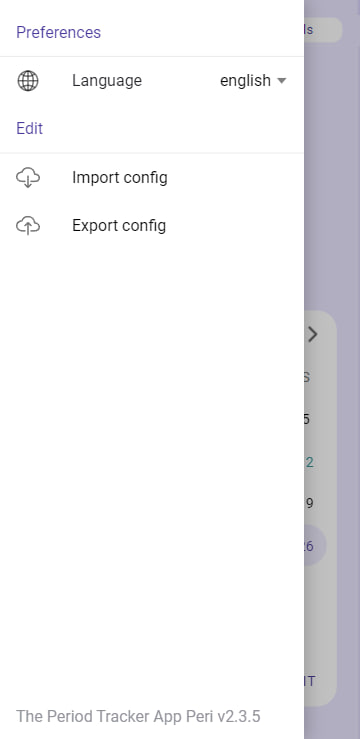

    
  <h3 align="center">Peri</h3>
  

    The Period Tracker App
  

  

    <a href="https://irasoro.github.io/peri/">View Demo</a>
  

### About The Project

Peri is period tracker application. The application has the necessary features that help you track your cycle. The app shows:

- number of days before period,
- current cycle day,
- chance of getting pregnant,
- number of days before ovulation,
- possible next period date,
- history of previous cycles,
- the average value of the cycle length and the average value of the period length.

It also tracks the current phase of the cycle. And displays information about this phase and the symptoms that a woman may feel during this phase.

See the [open issues](https://github.com/IraSoro/peri/issues) and [project](https://github.com/users/IraSoro/projects/4/views/1) for a full list of known issues.

### Usage

<table>
  <tr>
    <td></td>
    <td></td>
    <td></td>
  </tr>
  <tr>
    <td align="center">Welcome page</td>
    <td align="center">Home</td>
    <td align="center">Details</td>
  </tr>
    <tr>
    <td></td>
    <td></td>
  </tr>
  <tr>
    <td align="center">Additional Info</td>
    <td align="center">Menu</td>
  </tr>
 </table>

### How to build

You can find the full instruction about the project building in [BUILDING.md](https://github.com/IraSoro/peri/blob/master/BUILDING.md) file.

### Help with translation

We welcome contributions to translate our application into different languages. If you want help with translations, you can find complete instructions in [CONTRIBUTING.md](https://github.com/IraSoro/peri/blob/master/CONTRIBUTING.md) file.
