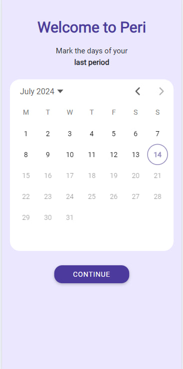
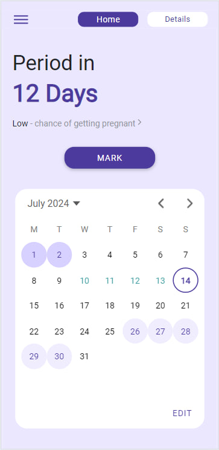
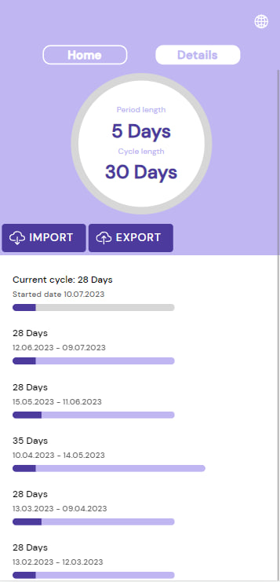
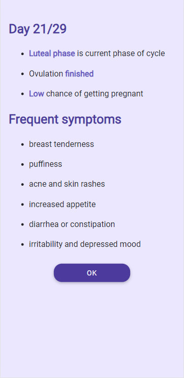

<!-- PROJECT LOGO -->
 

  
  <h3 align="center">Peri</h3>

  

    The Period Tracker App
  

  

    <a href="https://irasoro.github.io/peri/">View Demo</a>
  
  

<!-- ABOUT THE PROJECT -->
### About The Project

Peri is period tracker application. The application has the necessary features that help you track your cycle. App show:
- number of days before menstruation,
-  current cycle day,
- chance of getting pregnant,
- the number of days before ovulation.

Also keeps track of the current phase of the cycle. And displays information about this phase and the symptoms that a woman may feel in this phase.

### Built With
* [Ionic](https://ionicframework.com/)
* [React](https://reactjs.org/)
* [Ionic Storage](https://github.com/ionic-team/ionic-storage)

<!-- USAGE EXAMPLES -->
### Usage

<table>
  <tr>
    <td></td>
    <td></td>
    <td></td>
    <td></td>
  </tr>
  <tr>
    <td align="center">Welcome page</td>
    <td align="center">Home</td>
    <td align="center">Details</td>
    <td align="center">Phase info</td>
  </tr> 
 </table>

 <!-- FUTURE FEATURES -->
## Future features

- [ ] Sync data with the Flo app
- [ ] Multi-language Support
- [ ] Mark the days of your period on the calendar

See the [open issues](https://github.com/IraSoro/peri/issues) and [project](https://github.com/users/IraSoro/projects/4/views/1) for a full list of proposed features (and known issues).

 <!-- ICON -->
### Icon
From https://www.svgrepo.com/svg/14201/uterus-and-fallopian-tube-inside-woman-body-outline

